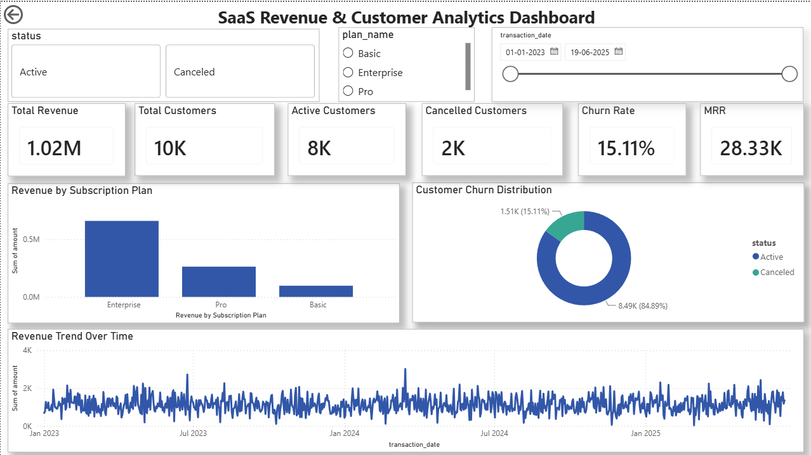

# SaaS Revenue & Customer Analytics Dashboard

## Project Overview

This project presents an interactive SaaS Revenue & Customer Analytics Dashboard built using Power BI and PostgreSQL. The dashboard provides key business insights into revenue performance, customer retention, subscription plan performance, churn analysis, and recurring revenue trends.

The objective of this project is to enable stakeholders to monitor business health, identify customer behavior patterns, and support data-driven decision making through real-time analytics.

---

## Business Problem

SaaS companies rely heavily on recurring revenue and customer retention. Understanding customer churn, subscription plan performance, and revenue trends is critical for sustainable growth.

This dashboard addresses the following business questions:

- How much revenue is being generated?
- What is the current customer base?
- What percentage of customers are churning?
- Which subscription plans generate the highest revenue?
- How does revenue trend over time?
- What is the Monthly Recurring Revenue (MRR)?

---

## Dashboard KPIs

| KPI | Description |
|------|-------------|
| Total Revenue | Total revenue generated from subscriptions |
| Total Customers | Total customer count |
| Active Customers | Customers with active subscriptions |
| Cancelled Customers | Customers who have churned |
| Churn Rate | Percentage of cancelled customers |
| MRR | Monthly Recurring Revenue |

---

## Dashboard Features

### Interactive Filters
- Customer Status Filter
- Subscription Plan Filter
- Transaction Date Range Filter

### Visualizations
- Revenue by Subscription Plan
- Customer Churn Distribution
- Revenue Trend Over Time
- Executive KPI Cards

---

## Technology Stack

| Tool | Purpose |
|--------|---------|
| PostgreSQL | Data Storage |
| SQL | Data Analysis & Querying |
| Power BI | Dashboard Development |
| DAX | KPI Calculations |
| Excel/CSV | Data Source |

---

## Key DAX Measures

### Active Customers

```DAX
Active Customers =
CALCULATE(
    COUNT(customer_id),
    status = "Active"
)
```

### Cancelled Customers

```DAX
Cancelled Customers =
CALCULATE(
    COUNT(customer_id),
    status = "Canceled"
)
```

### Churn Rate

```DAX
Churn Rate =
DIVIDE(
    [Cancelled Customers],
    [Total Customers]
)
```

### Monthly Recurring Revenue (MRR)

```DAX
MRR =
DIVIDE(
    [Total Revenue],
    36
)
```

---

## Dashboard Preview



---

## Business Insights

### Revenue Analysis
- Enterprise subscriptions contribute the highest share of revenue.
- Premium plans significantly outperform basic plans.

### Customer Retention
- Approximately 85% of customers remain active.
- Churn rate remains around 15%, indicating relatively strong retention.

### Revenue Trend
- Revenue demonstrates stable growth patterns over the analyzed period.
- Seasonal fluctuations and transaction spikes can be identified through trend analysis.

---

## Project Structure

```
saas-revenue-analytics/
│
├── dashboard/
├── data/
├── database/
├── scripts/
├── saas_dashboard.png
├── saas_revenue_customer_analytics_dashboard.pbix
└── README.md
```

---

## Skills Demonstrated

- Data Analysis
- SQL Querying
- Data Modeling
- Business Intelligence
- Dashboard Design
- KPI Development
- DAX Calculations
- Data Visualization
- Business Metrics Analysis

---

## Author

**Preethi Beri**

LinkedIn: https://www.linkedin.com/in/preethi-beri/

GitHub: https://github.com/preethi-beri